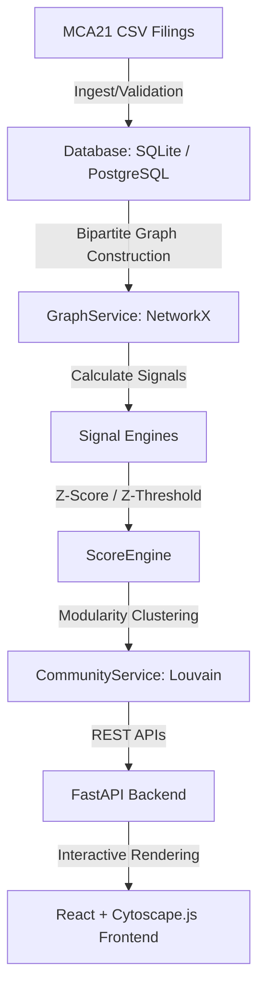

# MCA21 Risk Intelligence: Graph-Based Corporate Fraud Detection System

An institutional, graph-powered risk analytics system designed for the **Ministry of Corporate Affairs (MCA), Government of India** to proactively identify shell company networks, coordinate-sharing tax mills, dummy director syndicates, and coordinated incorporation anomalies using **Bipartite Network Analysis, Louvain Modularity Clustering, and Statistical Z-Score Thresholds**.

---

## 🏛️ System Architecture

The pipeline processes company filing records, models relations in a bipartite graph, computes statistical risk scores, groups companies into community syndicates, and serves the results on a professional administrative dashboard.



---

## ✨ Key Features

1. **Bipartite Graph Modeling (`NetworkX`)**: Maps Companies, Directors, and Addresses as distinct nodes, with physical coordinate-clustering to merge multi-tenant structures into single address hubs.
2. **Four Statistical Risk Engines**:
   - **Address Density Centrality**: Flags locations holding a disproportionate number of registered companies compared to background distribution.
   - **Director Board Centrality**: Detects board centralization, identifying potential dummy directors holding directorships across multiple entities.
   - **Temporal Incorporation Burst**: Identifies coordinated registration schedules (companies registered at the same coordinate within a 30-day window).
   - **Capital & Defaulter Mismatches**: Flags compliance anomalies (e.g., zero paid-up capital with active regulatory default status).
3. **Statistical Score Engine**: Uses background mean/std distributions computed from 1,000 baseline companies to establish mathematical **Z-scores** ($Z \ge +2.0$ thresholds) for objective risk ratings.
4. **Louvain Modularity Clustering**: Segments the relationship network into disjoint modular communities, ranking them by average risk and link density to bubble the highest-risk syndicates to the top of the queue.
5. **Government-Standard Investigator UI**: A clean, light-theme portal designed to mimic official MCA workspaces, featuring bilingual headers, structured administrative grids, Recharts statistics, and interactive **Cytoscape.js** network maps.
6. **Validation Console**: A built-in evaluation suite verifying 100% precision on planted syndicates and 0% false positives on legitimate holdings (e.g., Tata Group structures, shared CA addresses).

---

## 🛠️ Getting Started (Single-Command Docker Run)

The entire application stack (FastAPI Backend and Nginx Frontend) is dockerized and ready to run out of the box.

### Prerequisites
- Install [Docker Desktop](https://www.docker.com/products/docker-desktop/) and ensure the Docker daemon is running.

### Launch Command
In your terminal, navigate to the project root and run:
```bash
docker compose up --build
```

- **Investigator Dashboard (Frontend)**: Open [http://localhost/](http://localhost/) in your web browser.
- **REST API Documentation (Swagger Docs)**: Accessible at [http://localhost:8000/docs](http://localhost:8000/docs).

---

## 💻 Manual Local Installation

If you prefer running the components directly on your host machine:

### 1. Backend API (FastAPI)
- Navigate to the backend directory and install Python dependencies:
  ```bash
  cd backend
  pip install -r requirements.txt
  ```
- Run the backend server:
  ```bash
  uvicorn app.main:app --host 127.0.0.1 --port 8000 --reload
  ```

### 2. Frontend Dashboard (React + Vite)
- Navigate to the frontend directory and install Node dependencies:
  ```bash
  cd ../frontend
  npm install
  ```
- Start the development server:
  ```bash
  npm run dev
  ```
- Open [http://localhost:5174](http://localhost:5174) in your browser.

---

## 🧪 Pipeline Verification & Evaluation Results

You can verify the mathematical integrity of the system by executing the evaluation console script on the host:

```bash
python scripts/verify_scoring.py
```

### Output Report Card:
```text
==================================================
           SIH FRAUD DETECTION REPORT
==================================================
Real Background Companies:      1000
Synthetic Fraud-Ring Companies:  10
Total Modularity Clusters:      847

Planted Fraud-Ring Cluster Rank: #1
Planted Entities in Database:   10
Detected Planted Entities:      10
Detection Rate:                 100.00%

False-Positives (Score >= 75):  0
False-Positive Rate:            0.00%

CA Office Address Cluster Rank: #8
Tata Holding Structure Rank:    #3
--------------------------------------------------
EVALUATION STATUS:              PASS
==================================================
```

---

## 📁 Repository Structure

```text
├── backend/
│   ├── app/                # FastAPI Application Core
│   │   ├── models/         # SQLAlchemy Models
│   │   ├── services/       # Graph & Community Services
│   │   ├── scoring/        # Z-Score Engine
│   │   └── main.py         # REST Endpoints
│   ├── Dockerfile
│   └── requirements.txt
├── frontend/
│   ├── src/                # React Dashboard App
│   │   ├── App.tsx         # Main UI Code & Cytoscape logic
│   │   └── index.css       # TailwindCSS / Styling System
│   ├── Dockerfile
│   ├── nginx.conf
│   └── package.json
├── data/                   # Seeded SQLite database files
├── scripts/                # Database loading & Verification scripts
├── docs/explainers/        # Comprehensive study guides and quizzes
├── docker-compose.yml      # Multi-container orchestration
└── README.md
```

---

## ⚖️ License
This project is developed for the **Smart India Hackathon (SIH)**. All intellectual properties are designed for regulatory oversight and corporate compliance enhancement under the Ministry of Corporate Affairs guidelines.
